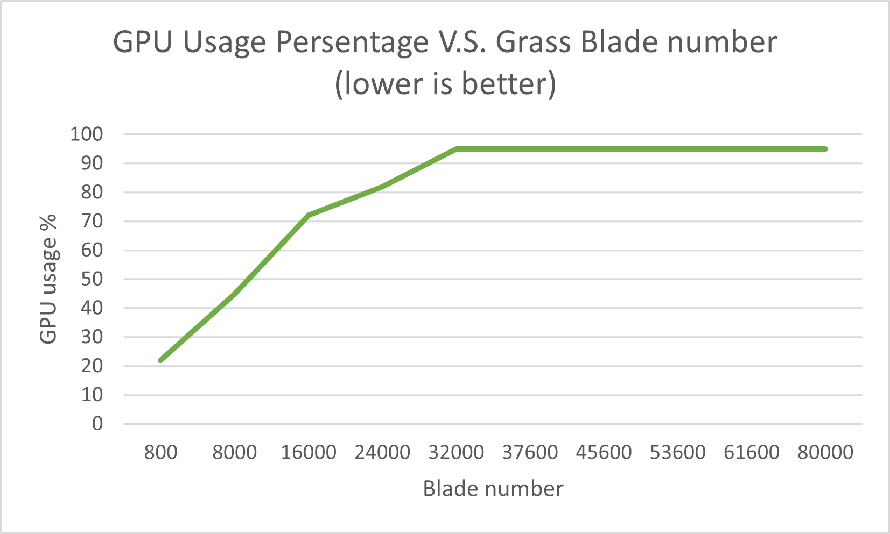

# 
 ARCreation : AR Procedural Generation 

**University of Pennsylvania, CIS 565: GPU Programming and Architecture, Final Project**

* [Guanlin Huang](https://www.linkedin.com/in/guanlin-huang-4406668502/), [Shutong Wu](https://www.linkedin.com/in/shutong-wu-214043172/), [Rhuta Joshi]()
 * Tested on: Samsung Tablet S8, Qualcomm SM8450 Snapdragon 8 Gen 1;CPU: Octa-core (1x3.00 GHz Cortex-X2 & 3x2.50 GHz Cortex-A710 & 4x1.80 GHz Cortex-A510), GPU: 	Adreno 730

## Installation
Download and install the .APK file to your android device. Make Sure Google ARCore is downloaded.

## Usage Instruction
Tap the assets you want to see at the bottom of the screen, and then tap on the phone to create it.  

Overview
===========
Project ARC is proposed to implement an application for adding procedural elements to the real world view. One hidden problem of procedural generation is its performance with large number of generations, and we intent to solve this with GPU. We have implemented grass and customized L-system in Unity and show it in AR with Unity AR Foundation. 

Implementation
===========
## Grass
The grass is rendered through Unity Universal Render Pipeline shaders.
  
In order to have grass curvature and convincing grass movement, each blade of grass is divided into a number of segments. Comparing to tessellation, this method saves more memory and is more efficient to construct and compute. 
  

  
The wind is implemented by sampling from a noise texture. the UV coordinate is constructed using the grass blades' input points; this will ensure that with multiple grass instances they will behave the same. The wind is then applied using a scaled rotation matrix to each segment of the grass blade.
  

  
Similar to how wind is applied, the interaction bending is applied with the scaled rotation matrix with respect to the distance of the device and grass
  

  
## GPU-based L-system
We implement our L-system generation process based on the paper [Parallel Generation of L-Systems](https://publik.tuwien.ac.at/files/PubDat_181216.pdf). Unlike the paper which uses CUDA to implement the L-System, we are using Unity with its compute shader for generation. The implementation can be broken down to three parts: 
* L-System Derivation : Turn the axiom string to a derived string based on selected rulesets
* L-System Interpretation: Transform the string to a list of position/orientation/material array that we use to draw for each symbol
* Rendering: render all the items in the array to the scene

### L-System Derivation&Interpretation
 
Before the derivation starts, there will be a preparation step where every customized rulesets will be loaded into the script, and the compute shader will know what each character will derive into. 
In the derivation process, each thread will take care of each character in the string, and a prefix sum scan function is used to calculate the total length of the new derived string. Because Compute Shader does not accept character, we are converting character to ASCII code to make sure the dispatch of compute shader goes smoothly.  
In each iteration of derivation(L-System might go many iterations), we will first use the scan function to examine the total string length of next iteration's derived string, then we use the prefix sum array to identify the derived characters' indices in the new string. A new string will be generated after this step. 
Our scan function can deal with 512*512 = 262144 elements, and it is sufficient for this project and basically the most complex L-system generation. 

 
Unlike the procedure taken in the paper, we decide to use a 1D linked list to help finish the interpretation in a simpler fashion. 
After we get all the strings from derivation, we will then run: 
* A kernel that identify if each character is a symbol(Something to draw) or not
* A kernel that identify each character's depth
* A kernel that identify the position/orientation vector that the character might change to the next character

### L-System Rendering

### 2D Noise Procedural Generation

## AR Interaction

## Performance Analysis

### Grass Performance

  
  
### L-System Performance

### Overall Performance
 
## Future Work

## Credits
* [Grass Shader Tutorial](https://roystan.net/articles/grass-shader/)

## Past Presentation
[Milestone 1 Presentation](https://docs.google.com/presentation/d/16BDfPikoMo0FX5iWDb8mwlZ5nQAJBaDj30A9Vw1sQ5o/edit#slide=id.p) 
[Milestone 2 Presentation](https://docs.google.com/presentation/d/1iHksZZ4u2Z6-Yoie_S-0kXjdsAEHsFWQpKVJzvuKXFI/edit#slide=id.p) 
[Milestone 3 Presentation](https://docs.google.com/presentation/d/1cWZAUilfjqYLi6OaeJzwCYyNQ0r6AfFJXVTBsvolfYg/edit#slide=id.g19cafe9bbc4_0_3) 
[Final Presentation]()

## Blooper
"May the force be with you" 
  
  
