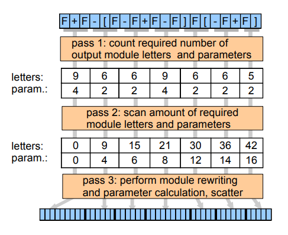
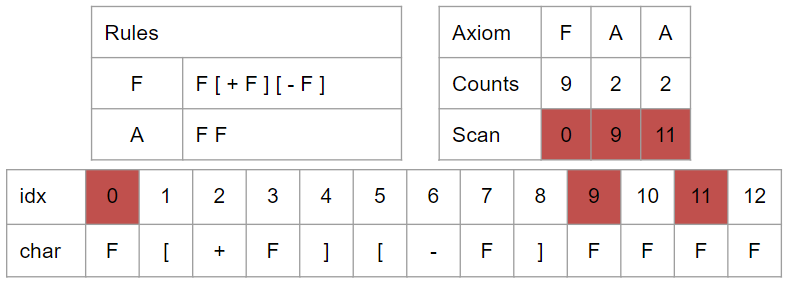
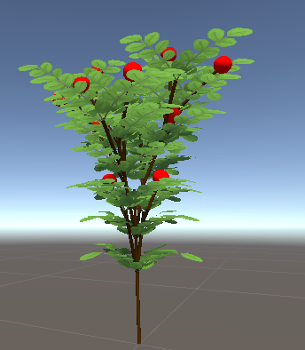
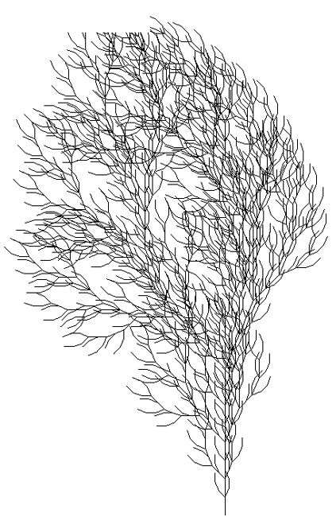
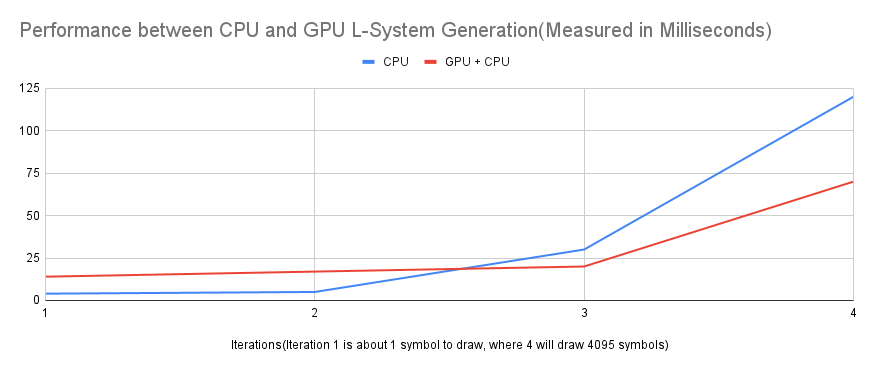
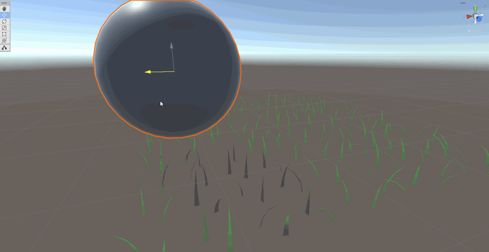
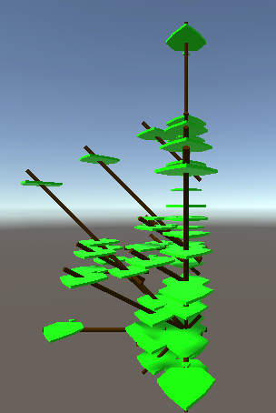
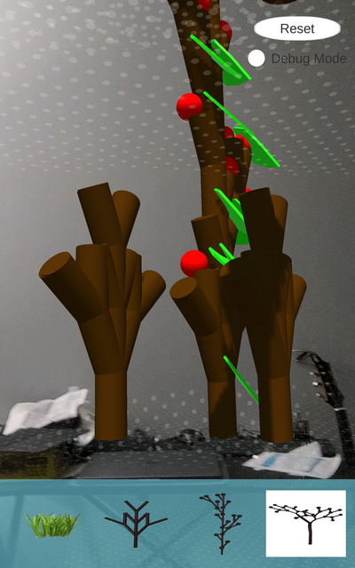
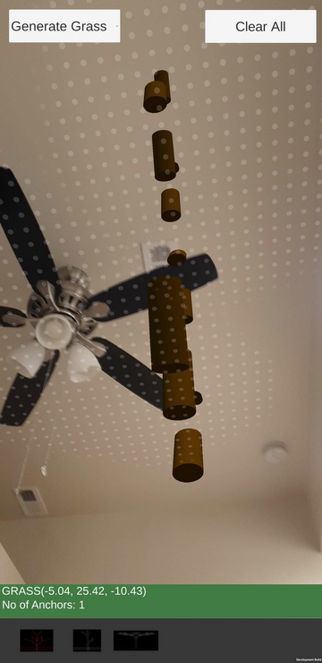

# <div align="center"> ARC or ARCreation : AR app for procedural generation </div>

**University of Pennsylvania, CIS 565: GPU Programming and Architecture, Final Project**

* [Guanlin Huang](https://virulentkid.github.io/personal_web/index.html), [Shutong Wu](https://www.linkedin.com/in/shutong-wu-214043172/), [Rhuta Joshi](https://www.linkedin.com/in/rcj9719/)
 * Tested on: Samsung Tablet S8, Qualcomm SM8450 Snapdragon 8 Gen 1;CPU: Octa-core (1x3.00 GHz Cortex-X2 & 3x2.50 GHz Cortex-A710 & 4x1.80 GHz Cortex-A510), GPU: 	Adreno 730

### [Link to project demo here](https://youtu.be/ZUIvCwbsThM)

Overview
===========
Project ARC is proposed to implement an application for adding procedural elements to the real world view. One hidden problem of procedural generation is its performance with large number of generations, and we intent to solve this with GPU. We have implemented grass and customized L-system in Unity and show it in AR with Unity AR Foundation.   

|Basic design of application|
|---|
||


### Installation
The app has not been released to the public on a mobile app store, but the code can be downloaded and built in Unity. Download and install the .APK file to your android device. AR experiences on Android devices are driven by ARCore, which is available on [ARCore supported devices](https://developers.google.com/ar/devices). Ensure that your development device is compatible with AR. Alternatively, you can use a correctly configured AR-compatible Android Emulator instance.

### Usage Instruction

The app allows you to select type of grass or procedurally generated trees you would like to place in the AR view. It works best in a larger area with some feature points where ARCore plane detection works well.
1. Click on the `Show Panel` switch to view a panel with items to place.
2. Scan the room till you see light white dots on the plane indicating surface detection.
3. Once the surface is detected, you can tap anywhere on the plane to see the selected procedural item in AR view.
4. You can also turn on the `Presets` where we provide some options to view a pre-set arrangement of trees, grass and plants arranged as a garden.
5. An option to view some additional `Debug Info` is also provided
6. At any time, you can use the clear screen option to reset and start over.

[Video of usage demonstration here](https://linksharing.samsungcloud.com/hIEd5AV9jhCG)

### Developer Setup

- Developed using Unity 2021.3.13f1. we recommend using Unity Hub.
- Clone this repo to your machine (optionally fork this repository if you plan on expanding on it).
- Open the project in Unity 2021.3.13f1, and open the 'ARCScene' scene (if it doesn't open automatically).
- Deploy to an [ARCore compatible device](https://developers.google.com/ar/discover/supported-devices).
- Version control system used during development - Plastic SCM

---  
### Implementation contents

- [Grass](#grass)
- [GPU-based L-system](#gpu-based-l-system)
  - [L-System Derivation & Interpretation](#l-system-derivation-and-interpretation)
  - [L-System Rendering](#l-system-rendering)
  - [2D Noise Procedural Generation](#2d-noise-procedural-generation)
- [Integrating it with AR](#integrating-it-with-ar)

### Presentations and other documentation
- [Project board, bug tracker and resources](https://cis-565-final-project.notion.site/Team-ARC-f8764bf740f6408ebb3c7bdedbad31f6)   
- [Project Pitch](https://docs.google.com/presentation/d/19CZpP7CKG2L5rKTixmAmIi9_ogACH7zY3G-8qamP4r0/edit?usp=sharing)
- [Milestone 1 Presentation](https://docs.google.com/presentation/d/16BDfPikoMo0FX5iWDb8mwlZ5nQAJBaDj30A9Vw1sQ5o/edit#slide=id.p)   
- [Milestone 2 Presentation](https://docs.google.com/presentation/d/1iHksZZ4u2Z6-Yoie_S-0kXjdsAEHsFWQpKVJzvuKXFI/edit#slide=id.p)   
- [Milestone 3 Presentation](https://docs.google.com/presentation/d/1cWZAUilfjqYLi6OaeJzwCYyNQ0r6AfFJXVTBsvolfYg/edit#slide=id.g19cafe9bbc4_0_3)   
- [Final Presentation](https://docs.google.com/presentation/d/1nhRvU-0dief0bP7L1LuMD3uFziOVkGfzeUahdgH2EHA/edit?usp=sharing)   

Implementation
===========
## Grass
The grass is rendered through Unity Universal Render Pipeline compute shaders, which can take in a single mesh shape as input, and generate other mesh as outputs. In this project, we decided to put a plane mesh as input, and for each vertex of that plane, we output a single triangle to represent a grass blade. To render those grass blades with decent color, we also need a fragment shader and interpolate between a base grass color and a tip grass color. The output should look like the following:
  

  
To make the grass more realistic,we want to change the height of the grass blades so that they do not look too triangle-like. Next, we need randomly twist the grass blades so that they will not be facing the same direction; we also need to bend the grass to mimic gravity. To accomplish the transformational goals, the blade will first be defined in space close to the vertex emitting it, after which it will be transformed to be local to the mesh. We implemented tangent space to cope with this need.
|Tangent Space ([Image source](https://en.wikipedia.org/wiki/Tangent_space#/media/File:Image_Tangent-plane.svg)) |
|---|
||

In order to have grass curvature and convincing grass movement, each blade of grass is divided into a number of segments. Comparing to tessellation, this method saves more memory and is more efficient to construct and compute. 

|Grass construction ([Image source](https://roystan.net/articles/grass-shader/)) |
|---|
||
  
The wind is implemented by sampling from a noise texture. the UV coordinate is constructed using the grass blades' input points; this will ensure that with multiple grass instances they will behave the same. The wind is then applied using a scaled rotation matrix to each segment of the grass blade. Combining with some variance in blade shapes, the final result looks like this:  

|Grass under noise based wind forces|
|---|
||

The grass also interacts with the device camera. This means that when a user moves the device camera closer or further away from the grass, the grass bends interactively. Similar to how wind is applied, the interaction bending is applied with the scaled rotation matrix with respect to the distance of the device and grass.   

|Grass interaction with device camera|
|---|
||

---

## GPU-based L-system
We implement our L-system generation process based on the paper [Parallel Generation of L-Systems](https://publik.tuwien.ac.at/files/PubDat_181216.pdf). Unlike the paper which uses CUDA to implement the L-System, we are using Unity with its compute shader for generation. The implementation can be broken down to three parts:   
* L-System Derivation : Turn the axiom string to a derived string based on selected rulesets
* L-System Interpretation: Transform the string to a list of position/orientation/material array that we use to draw for each symbol
* Rendering: render all the items in the array to the scene

### L-System Derivation and Interpretation

|Parallel Lsystem Generation Workflow used|
|---|
||

#### Stage 1: Preparation and loading

Before the derivation starts, there will be a preparation step where every customized rulesets will be loaded into the script, and the compute shader will know what each character will derive into.

Consider the following L-System Example:

```
AXIOM: FAA
Rules:
  F -> F[+F][-F]
  A -> FF
```

The above rules get passed to the GPU in 2 buffers - the predecessor buffer and the successor buffer which are obtained by serially appending all grammar rules.

```
Predecessor Buffer: FA  // Concatenating the left side of all rules
Successor Buffer: F[+F][-F]FF   // Concatenating the right side of all rules
```

#### Stage 2: Parallel Derivation - Expanding the string

In the derivation process, each thread will take care of each character in the string, and a prefix sum scan function is used to calculate the total length of the new derived string. Because Compute Shader does not accept character, we are converting character to ASCII code to make sure the dispatch of compute shader goes smoothly.   
In each iteration of derivation(L-System might go many iterations), we will first use the scan function to examine the total string length of next iteration's derived string, then we use the prefix sum array to identify the derived characters' indices in the new string. A new string will be generated after this step.   
Our scan function can deal with 512*512 = 262144 elements for each L-System, and it is sufficient for this project and basically the most complex L-system generation.   

| Derivation example from Base Paper | Understanding our example |
|---|---|
|||


#### Stage 3: Parallel Interpretation - Positioning & branching based on expanded string

This is the paper's approach to the interpretation, but after careful thinking we decide to use a 1D linked list to help finish the interpretation in a simpler fashion.   
After we get all the strings from derivation, we will then set data for:<br>
* SymbolBuffer: A compute buffer that identify if each character is a symbol(Something to draw) or not
* DepthBuffer: A compute buffer that identify each character's depth
* PosBuffer/OriBuffer: A kernel that identify the position/orientation vector that the character might change to the next character<br>

| Interpretation example from Base Paper | Our Linked List based implementation |
|---|---|
|||

Then after a prefix sum scan of the Depth buffer and Pos/Ori Buffer, we will then set data for LinkedBuffer, where each index will store its parent's index. This solves the hardest problem when constructing L-system, which is to have every symbol to have its predecessor's data.   
Finally we iterate through the array, fetching all the symbols that need to be draw and their local coordinates. The interpretation marks complete up to this point.

### L-System Rendering

<br>

We have implemented rendering in two ways, one in CPU and one in GPU, to render L-System based on different needs.  
For CPU, we simply instantiate the gameobject we have for each symbol and under not complex scenes their performance is relatively acceptive. The point of keeping this is for debugging and to compare its performance against GPU rendering in terms of simple to not very complex(below 100 L-system) scene.  
For GPU, we originally passed the mesh/vertex/triangles information to vertex shader and run a shader file to render this at runtime; but during search we find Unity have a DrawProcedural and DrawMesh function, where we can let GPU render mesh at giving world coordinates at runtime, so we also implement this rendering procedure.


### 2D Noise Procedural Generation
We also implemented a noise procedural generation where you can generate these L-system trees with a certain probability. We can scale each tree's probability of appearance, their distances between other, and the boundary of the generation.  


## Integrating it with AR

Setting up AR environment included a bunch of steps elaborately explained in [Google documentation here.](https://developers.google.com/ar/develop/unity-arf/getting-started-ar-foundation)
Considering future scope of the project, we have also set up ARCore extensions as [documented here.](https://developers.google.com/ar/develop/unity-arf/getting-started-extensions)

ARCore is Google's framework for building augmented reality experiences on smartphones. We are using Unity's AR Foundation to build this application. We need to take care of two things - detecting surfaces/planes and placing objects in real world scene based on user interaction like tap or dragging on screen. This is mainly accomplished using the following:

1. ARPlaneManager - An ARPlaneManager detects ARPlanes and creates, updates, and removes game objects when the device's understanding of the environment changes.
2. ARRaycastManager - An ARRaycastManager exposes raycast functionality in which we shoot a ray from the screen coordinates of our tap into the real world detected and we store the intersection points as hit points. Refer to the image shown below taken from Google Cdoelabs.
3. ARAnchorManager - ARAnchorManager is used to track elements (gameobjects) in the real world. In our application, we are tracking each lsystem that the user places so that we can interact with them better and befause we want to anchor and orient them correctly along the plane detected. The number of anchors can be reduced since they are resource-intensive. 

|ARRayCast Hit from touch point on screen|
|---|
||

## Performance Analysis
 * Tested on: Samsung Tablet S8, Qualcomm SM8450 Snapdragon 8 Gen 1;CPU: Octa-core (1x3.00 GHz Cortex-X2 & 3x2.50 GHz Cortex-A710 & 4x1.80 GHz Cortex-A510), GPU: 	Adreno 730  

 For the performance analysis we will first do a analysis on each of the component we have implemented, and then we will analyze the overall performance to show that using GPU for L-system generation is a efficient idea.

### Grass Performance
The following graph shows how the number of grass blades will impact the framerate on the mobile device; the maximum framerate on our tester device is 31 FPS. With 800 blades covering approximately 1 square-meter(M<sup>2</sup>) of the real-world area, our App can cover up to 46M<sup>2</sup> of area, or 37600 blades of grass, without sacrificing framerate. 

  
The pressure on GPU caused by increasing the number grass blades shows why we would have a 37600 grass blades limit. After reaching 32000 grass blades, or approximately covering 40M<sup>2</sup> of area, the GPU usage reaches a throttle at 95%. From 37600 blades and onwards, the device will sacrifice framerate in order to render the grass blades properly.
 
### L-System Performance CPU vs GPU
We have compared two resources that are using different methods to generate L-System, one is using CPU to generate L-System entirely and one is our current work, which uses GPU to analysis the grammar and only use CPU to instantiate the gameobject in the last step.  
For the sample to be compared with, we choose one of the L-System Bush written by Paul Bourke as a test case to pay tribute to his work on L-System. We will measure the time that take for them to generate different L-Systems.  
  
  
The performance analysis above shows the different time taken for each method to generate the tree. At early iterations where there are only 100 or fewer symbols to draw, CPU/GPU takes similar time to generate and CPU is even faster in terms of milliseconds. But at later iterations where thousands of symbols will be drawn to the screen, time taken for CPU version is exponentially increasing and become slower than GPU version.  
The reason of the time is that GPU's parallelism may not be fully used until the grammar is complex enough. But one problem with GPU and Unity's compute shader is that if the grammar is too complex and the whole derived string exceed the maximum length of string then GPU version would not work correctly. This will be a future upgrade if possible, but for now the current version could handle 262144 elements which is sufficient enough for most L-system trees.

### Overall Performance

## Credits
* [Ned Makes Games: Blade Grass](https://www.youtube.com/watch?v=6SFTcDNqwaA&ab_channel=NedMakesGames)
* [Parallel Generation of L-Systems](https://publik.tuwien.ac.at/files/PubDat_181216.pdf)
* [Roystan: Grass Shader Tutorial](https://roystan.net/articles/grass-shader/)

### Unity Free Asset Packs used include:
- Stylized Hand Painted Nature Pack by BigRookGames
- Hand Painted Flowers by Infinity3DGame


## Bloopers

|May the force be with you|
|---|
||

|Grammatical mistakes|Copy paste|Reaching for the skies|
|---|---|---|
||||
